## Rate limiter
```
In web applications (HTTP), it specifically caps how many requests a user, IP address, or device can make within a strict time window. Any requests that exceed this defined threshold are immediately blocked or dropped.

Accuracy: It has to actually work and block what it's supposed to block.

Low Latency: The rate limiter sits in the critical path of every single request. If it is slow, the entire application is slow.

Low Memory: It needs to track millions of users or IPs efficiently without eating up expensive server RAM.

Distributed: It cannot just work on a single machine; it must synchronize state across many servers.

Exception Handling: It must return clear signals (like an HTTP 429 status code) so clients know why they were blocked.

High Fault Tolerance: If the rate limiter crashes or its cache goes offline, it should "fail open" so the core application can stay online and serve traffic.
```
## two types of rate limiter
```
Why this distinction matters: A request-level limiter sits right at the entry point of your system (like an API Gateway or a reverse proxy). It doesn't care what the payload means; it only cares about the network/HTTP layer metrics (e.g., "Has User X hit this endpoint more than 100 times this minute?").

Contrast with Business-Level Limiting: Business-level throttling requires looking deep into application data (e.g., "Has this user transferred more than $5,000 today?"). Business limits are usually handled inside the microservices themselves using a database, whereas request-level limits are handled via hyper-fast, in-memory caches like Redis to protect the infrastructure.

```
## functional requirements
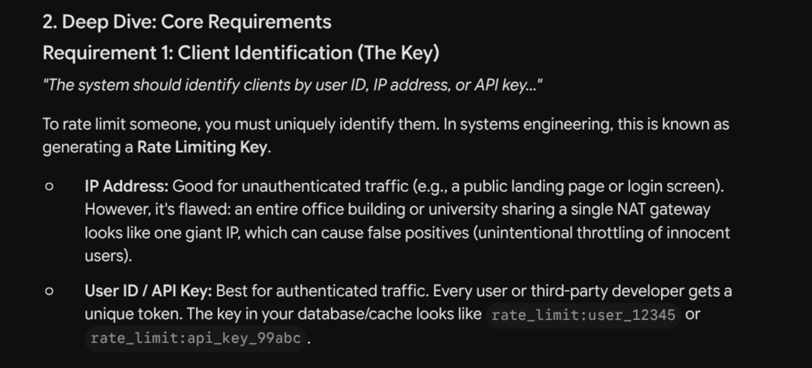
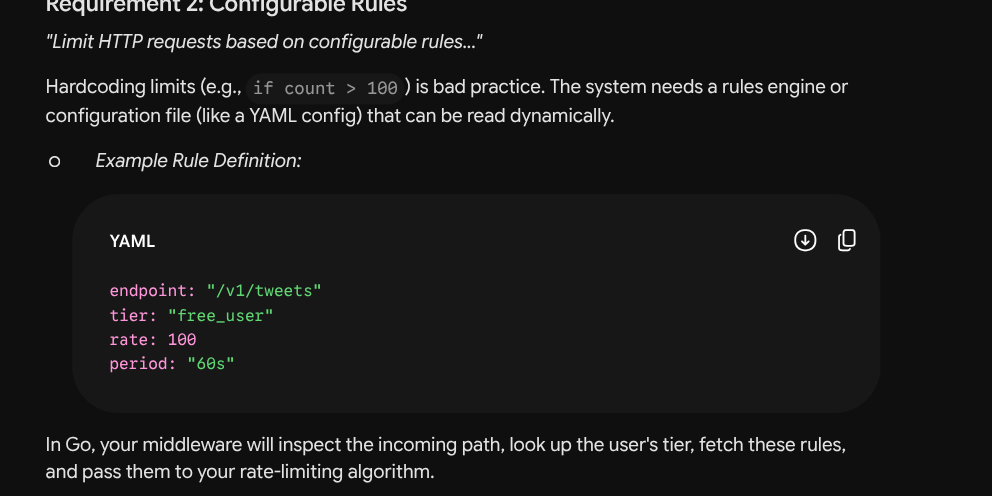
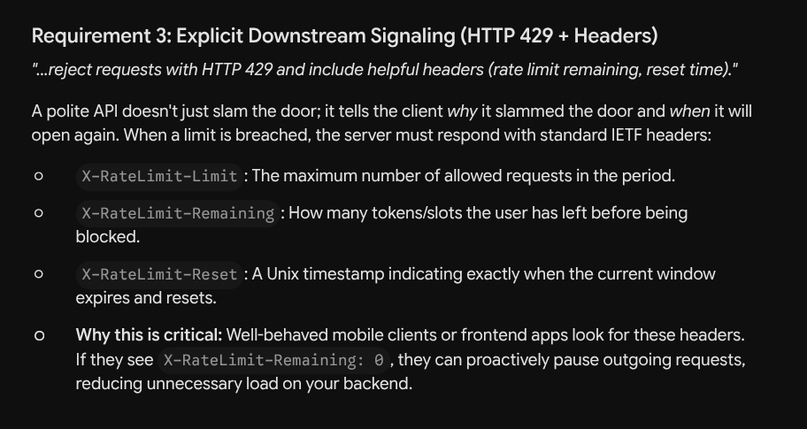
```
When you build this in Go, this image tells you exactly what your struct definitions need to track. You won't be building database savers or analytics endpoints. Instead, you'll be writing middleware that extracts an API Key or IP from r.RemoteAddr or the Authorization header, checks it against an in-memory map or Redis instance, updates the count, and sets the w.Header().Set("X-RateLimit-Reset", ...) before returning http.StatusTooManyRequests.
API Key: This is the standard for developer-facing APIs (like Stripe or Twilio). Each developer gets a unique key, usually passed in an X-API-Key header, giving them their own isolated rate limit.

```
## non functional requirement
```
The text sets a massive baseline: 1 million requests per second (RPS) across 100 million daily active users (DAU).

What this means: You cannot run this on a single server or store the state in a standard relational database (like PostgreSQL). The sheer volume of traffic requires a horizontally scaled, distributed system using ultra-fast, in-memory data stores.

Core Requirement: Ultra-Low Latency (< 10ms)
"The system should introduce minimal latency overhead (< 10ms per request check)."
The engineering impact: To achieve sub-10ms checks, you must avoid heavy disk I/O. The data (user limits and current counts) must be stored in RAM, either in the application's local memory or in a highly optimized cache cluster like Redis.
The practical result: If a user’s limit is 100, and they fire a burst of requests to three different servers simultaneously, the system might accidentally let 102 requests through before the servers sync up and block them. In the real world, allowing a couple of extra requests is vastly preferable to bringing down the entire API just to keep the math perfect.

availability >> consistency is a standard engineering shorthand confirming the system will "fail open" (keep accepting requests if the limiter crashes) rather than "fail closed" (block all traffic if the limiter crashes).
```
## flow
```
A Request arrives. Your middleware extracts the context (e.g., Endpoint: /search, IP: 192.168.1.5).

Your system looks up the Rules for that specific endpoint and identifier type.

Your system fetches the current Client state (e.g., from Redis) to see how many requests that IP has made.

Your algorithm evaluates the state against the rules. If it passes, update the state and allow the request. If it fails, block it.
```

## mvp phase
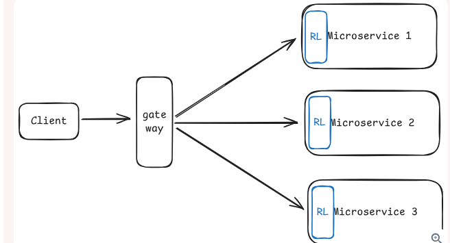
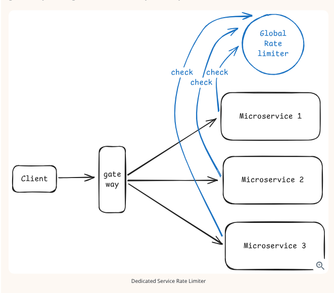
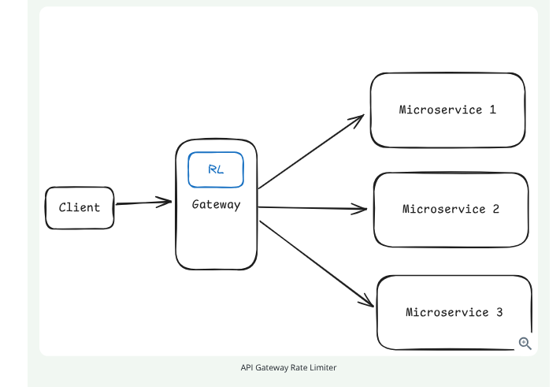
```
bad approach->
Where it lives: In this design, the rate limiting logic is built directly into the application code of each individual server or microservice.

How it works: As illustrated in the diagram, a client request passes through a gateway and is routed to a specific microservice (e.g., Microservice 1, 2, or 3), where that specific service uses its own internal "RL" (Rate Limiter) block to evaluate the request. The server checks its own local, in-memory counters to decide whether to accept or reject the call.

The Advantage: This method is extremely fast because everything happens in local memory, requiring zero external network calls or outside dependencies.
The text concludes that this approach is only acceptable in two specific scenarios:

You are only running a single application server.

Your system is okay with "approximate limits" where it is acceptable for users to exceed their limits by a factor equal to the number of servers you are running.

The core flaw of this design is that each server only knows about its own traffic and lacks a global picture of the system. This leads to severe synchronization issues in a distributed environment:

Multiplied Limits: If you want to limit a user to 100 requests per minute across a system with 5 servers, an uneven load balancer might route 100 requests to Server A and 100 requests to Server B. Because the servers do not talk to each other, both servers will allow the traffic, resulting in 200 total requests getting through.

Unpredictability: If the load balancer alters how it routes traffic, or if one server suddenly receives more load than the others, your rate limits become completely unpredictable.


Good idea
Instead of building rate limiting directly into individual servers, the rate limiter is extracted into its own distinct microservice that sits between the clients and the application servers.

The Flow: As shown in the diagram, when a client request reaches an application server (Microservice 1, 2, or 3), that server must pause and make a separate network call to the "Global Rate limiter".

The Decision: The application server asks, "Should I allow this request?". The dedicated rate limiter checks its central counters and replies with either a "yes" to proceed or a "no" to reject the request with a 429 status code.
The Challenges
While highly accurate, extracting the rate limiter into its own service introduces significant distributed systems complexities:

Added Latency: The biggest downside is that every single API request now requires an additional network round trip. Even if the dedicated service is fast (e.g., 10ms), adding 10ms to every request creates significant overhead at massive scale.

Single Point of Failure: You have introduced a new critical dependency. If the global rate limiter goes offline, the system must either "fail open" (allowing all traffic and risking a total system overload) or "fail closed" (blocking all traffic and taking the API offline).

Operational Complexity: This architecture requires your team to deploy, monitor, and scale a completely separate service. To prevent it from going down, it requires high availability, redundancy, health checks, and data replication.

Network Fragility: The architecture forces engineers to design fallbacks for network issues. If the network between the app server and the rate limiter partitions, or if the rate limiter is just responding slowly, the application server must decide whether to wait (increasing latency further) or timeout and guess the user's limit.


Best decision->
The Approach
In this design, the rate limiter operates at the very edge of the system, built directly into the API gateway or load balancer.

Every single incoming request hits this gateway first, before ever reaching the downstream application servers.

The gateway examines the HTTP request (looking at IP addresses, headers, and API keys) to check the limits, and then either forwards the traffic to the microservices or immediately drops it and returns an HTTP 429 response.

The Advantages
Ultimate Protection: The text compares this to a bouncer at a club. It stops troublemakers at the door, meaning your application servers never waste resources processing blocked requests.

Efficiency: It offers centralized control without forcing the system to make extra network calls for every single request.

The Challenges
Limited Context: Because the rate limiter sits at the network edge, it only sees basic HTTP information (like headers and URLs) and cannot see deep business logic. For instance, enforcing a rule where "premium users get 10x higher limits" is difficult unless that premium status is explicitly encoded into a JWT token.

External Dependencies: To function at high speeds, the gateway needs an external in-memory store like Redis to track the counters and timestamps. This introduces a new point of failure, forcing you to engineer fallback plans in case Redis becomes slow or unavailable.

```

## industrial practice
```
Layering Rules in Practice
The final section explains that production systems rarely rely on just one of these identifiers. Real-world systems use a combination of rules to create a robust defense layer. The text provides four examples of how these rules can be stacked:

Per-user limits: Ensuring a specific authenticated user (e.g., Alice) doesn't exceed 1000 requests an hour.

Per-IP limits: Catching abusive, unauthenticated bots by limiting individual IPs to 100 requests a minute.

Global limits: A massive "kill switch" that protects your servers by ensuring the entire API never processes more than 50,000 requests per second across all users.

Endpoint-specific limits: Recognizing that some API calls are heavier than others. For example, doing a complex database search might be limited to 10 times a minute, while a simple profile update allows 100 times a minute.

```
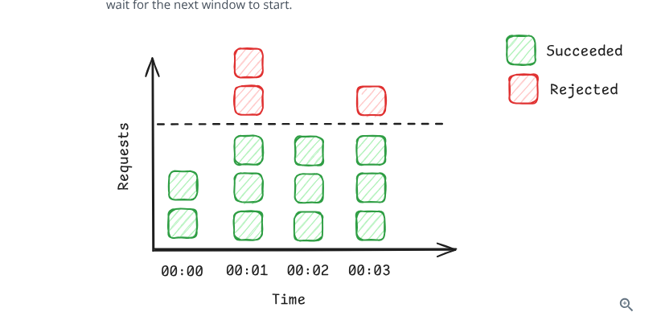
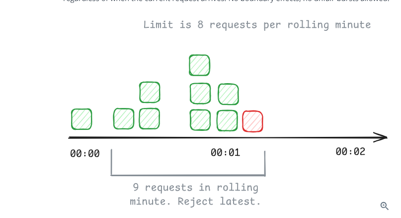
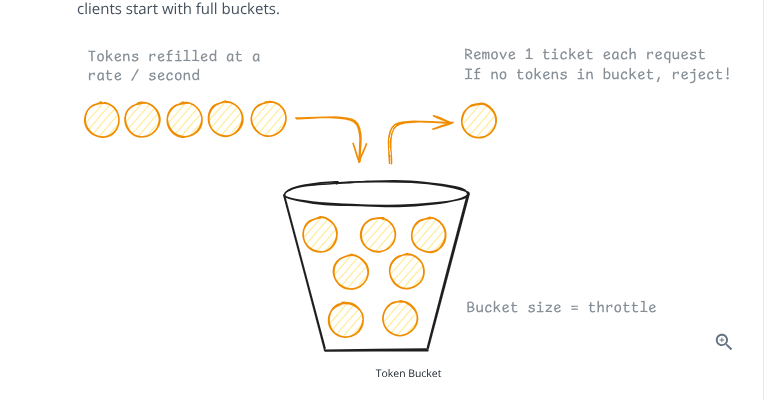
## algorithms
```
fixed counter algorithm->
The Rule: If a user’s limit is 3 requests per window, the system simply counts their requests as they come in.

The Graph: In the visual diagram, the dashed line represents the limit (which looks to be 3 requests).

At 00:00, the user makes 2 requests. Both succeed (green).

At 00:01, the user makes 5 requests. The first 3 succeed, hitting the limit. The system immediately rejects the next 2 (red).

At 00:02, the clock ticks over, the window resets, and the user's next requests are allowed again.
The Pros
Extremely low memory: You only need to store one integer per active user per window.

Easy to clean up: Because keys have specific time stamps, you can easily set a "Time to Live" (TTL) in Redis so the 12:00:00 keys automatically delete themselves at 12:01:00, freeing up memory.
The Fatal Flaw: The Boundary Effect
The text highlights a massive vulnerability with this approach, often called the "burst" or "boundary" problem.
Because the windows are rigid, a user can game the system right at the edge of a window change.

The Scenario: Imagine Alice is limited to 100 requests per minute.

At 12:00:59, Alice fires off 100 requests. The system allows all of them.

One second later, at 12:01:00, the window resets to zero. Alice immediately fires off another 100 requests. The system allows all of them.

The Result: Alice just sent 200 requests to your servers in exactly 2 seconds, completely defeating the purpose of a "100 requests per minute" limit and potentially crashing your backend.

1. Sliding Window Log
This algorithm solves the "boundary effect" flaw found in basic fixed window systems by tracking exact times rather than generic buckets.

How it Works: The system maintains a log of individual request timestamps for each user. When a new request comes in, the algorithm first removes any timestamps that are older than the defined time window (for example, older than one minute). It then checks if the remaining count of timestamps exceeds the allowed limit to decide whether to accept or reject the new request.
The Advantages: This method provides perfect accuracy. Because it looks at exactly the last $N$ minutes from the moment a request arrives, it completely eliminates boundary effects and prevents users from sneaking in unfair bursts of traffic. The visual diagram illustrates this by showing a rolling window where an 8-request limit is enforced, causing the 9th request to be rejected.
The Disadvantages: The primary downside is the heavy memory requirement. If a user is allowed 1000 requests per minute, the system must store 1000 individual timestamps. When scaled to millions of users, this leads to significant memory problems. Additionally, scanning through these timestamp logs for every single request introduces computational overhead.


Tocken bucket algo
This is the algorithm Stripe and many other major tech companies use because it elegantly handles real-world internet traffic, which is rarely perfectly smooth.

The Bucket (Burst Capacity): Imagine a literal bucket that can hold a maximum number of tokens (e.g., 100). If a user hasn't made any requests in a while, their bucket fills to the brim. This allows them to make a sudden "burst" of 100 requests all at once without being blocked.

The Drip (Refill Rate): Tokens are constantly dripped into the bucket at a steady, fixed rate (e.g., 10 tokens per minute).

The Logic: Every incoming request costs exactly 1 token. If the bucket has tokens, the request is allowed, and a token is removed. If the bucket is empty, the request is rejected (HTTP 429).

The Distributed Implementation (Using Redis)
As discussed in your earlier reading, keeping the bucket in a single server's local memory doesn't work at scale. You need a centralized source of truth so Gateway A and Gateway B both know how many tokens Alice has left.
The text proposes using Redis, a lightning-fast, in-memory database.

Here is the exact step-by-step logic your Go middleware would execute:

Read: The Gateway asks Redis for Alice's current token count and the exact timestamp of her last refill using the HMGET command.

Calculate (The Math): The Gateway looks at the current time, compares it to the last_refill timestamp, and calculates how many tokens Alice should have earned back during that elapsed time. It adds these new tokens to her remaining balance (capping it at the maximum bucket size).

Update (The Write): The Gateway subtracts 1 token for the current request and saves the new balance and the new timestamp back to Redis using a MULTI/EXEC transaction block (which groups commands together). It also sets an EXPIRE flag so Redis automatically deletes Alice's data if she stops making requests for an hour, saving memory.

3. The Fatal Flaw: The Race Condition
The final image introduces a subtle but catastrophic bug in the logic above.
Even though the write operation (MULTI/EXEC) is protected, the initial read operation (HMGET) is not. This creates a classic distributed systems Race Condition.

Imagine Alice has exactly 1 token left.

She fires two requests simultaneously. Request 1 hits Gateway A; Request 2 hits Gateway B.

Gateway A and Gateway B both ask Redis for Alice's balance at the exact same millisecond.

Redis replies to both of them: "Alice has 1 token."

Both gateways do the math, conclude Alice has enough tokens, allow the requests to pass, and update Redis to 0.

The Result: Alice just successfully made 2 requests, even though she only had 1 token. The rate limiter failed.
4. The Solution: Redis Lua Scripting
To fix this contention, you cannot separate the "Read", the "Calculate", and the "Write" into different steps. They must happen as one single, unbreakable action.
In Redis, you achieve this by writing a Lua Script. You send the script to Redis, and Redis executes the entire sequence (reading the balance, doing the time-elapsed math, deducting the token, and saving the new balance) atomically. While the Lua script runs, Redis blocks all other operations for that key, ensuring Gateway B must wait in line for Gateway A to finish modifying the state.

To really cement why this is such a dangerous bug in distributed systems, play with the simulation below to see how concurrent requests easily bypass standard logic.
```
## Rejection strategy
```
Once your algorithm determines a user is out of tokens, you have to decide exactly how your system handles the blocked request and communicates that failure back to the client.
Drop vs. Queue (The "Fail Fast" Philosophy)
When a user exceeds their limit, you have two choices: put their extra requests in a waiting line (queue) until their bucket refills, or slam the door immediately (drop).

Why Queuing is Dangerous: While queuing sounds polite, it is a massive anti-pattern for live web APIs. If a malicious bot sends 100,000 requests, storing those in a queue will rapidly eat up your server's memory. Furthermore, users hate waiting; if an API takes 10 seconds to respond because it was sitting in a queue, the user's browser will likely timeout, and they will just hit refresh, sending more traffic and worsening the bottleneck.

Why Dropping is Standard: The text strongly recommends the fail fast approach. You immediately reject the request and free up your server's resources to handle legitimate traffic. Queues should only be used for asynchronous, background batch-processing tasks, never for interactive APIs.

A well-designed API doesn't just cut the connection; it explains the rules to the client so the client can adjust its behavior.

The Status Code: You should always return an HTTP 429 (Too Many Requests) status. This is the universal, standard HTTP code that tells browsers, mobile apps, and other servers exactly why the request failed.

The Headers: To be truly helpful, your server should attach specific metadata to the response headers. This allows well-behaved client applications to programmatically pause their own outgoing requests until the penalty box time expires.

X-RateLimit-Limit: Tells the client their total capacity (e.g., "Your bucket holds 100 tokens").

X-RateLimit-Remaining: Tells the client how close they are to the edge (e.g., "0").

X-RateLimit-Reset: A Unix timestamp telling the client exactly when they will get their tokens back.

Retry-After: A simpler alternative that just gives a countdown in seconds (e.g., "Wait 30 seconds").

The final section marks a critical transition in the architecture design.
Up to this point, the guide has built a single-node system: a few API gateways talking to one single Redis server. That works perfectly for a mid-sized startup.

However, the text reminds you of the original constraints established at the very beginning: 1 Million Requests Per Second (RPS).

The Problem: A single Redis instance, no matter how powerful the hardware, will eventually bottleneck and crash if you try to force 1,000,000 read/write operations through it every single second.

The Next Steps: The "Deep Dives" will now focus on how to scale that bottleneck. You will have to start discussing advanced distributed systems concepts, such as clustering Redis into multiple shards, handling network partitions, and dealing with eventual consistency.

```
## how to scale 1 million request per second?
```
A single Redis instance is incredibly fast, but it obeys the laws of physics. It can process roughly 100,000 to 200,000 operations per second.
Because your Token Bucket algorithm requires multiple operations per request (read the state, calculate the time elapsed, write the new tokens back), a single Redis server will max out at around 50,000 to 100,000 rate limit checks per second. To hit 1,000,000 RPS, relying on one machine is impossible. You have a scaling writes problem.
2. The Solution: Sharding
To handle the load, you must spread the work across multiple Redis instances (shards). If one Redis server handles 100k RPS, you need 10 Redis servers running in parallel to hit 1M RPS
3. The Routing Logic: Consistent Hashing
You cannot just send requests to random Redis shards using a standard load balancer.
If Alice's 1st request goes to Shard A, Shard A records that she has 99 tokens left. If Alice's 2nd request goes to Shard B, Shard B has no idea who Alice is, assumes she has a full bucket, and starts a completely separate counter. Her rate limit state is fragmented and useless.

The Fix: You need a deterministic routing algorithm.
Your API Gateway must take the client's identifier (e.g., user:alice or ip:192.168.1.5), run it through a mathematical hash function, and use the output to pick the shard.

Because a hash function always produces the exact same output for the exact same input, Alice's requests will always map to Shard 2.

Bob's requests will always map to Shard 7.
This guarantees each user's state lives on exactly one shard, preventing fragmented buckets while distributing the overall traffic evenly across the cluster.
4. The Real-World Shortcut: Redis Cluster
The green callout box offers a critical piece of practical engineering advice. Writing flawless consistent hashing logic inside your API Gateway is difficult and prone to edge-case bugs (especially when shards go down and need to be replaced).
In production, you rarely build this yourself. You deploy a Redis Cluster, which natively handles the sharding under the hood. You just send the request to the cluster, and it automatically routes user:alice to the correct internal node using its 16,384 hash slots.

You can use the simulator below to visualize exactly how this hashing ensures data integrity when traffic is split across multiple servers.

```
## 2) How do we ensure high availability and fault tolerance?
```
hardware fails, and networks drop. Now that your architecture relies on multiple Redis shards, you have to design for the inevitable moment when one of them crashes.

If your API Gateway tries to check a user's token bucket, but the Redis shard holding that data is unresponsive, your Go code has to make a split-second decision on how to handle that request.

This page introduces the first of two main failure modes: Fail-Closed.
The Fail-Closed Strategy
How it works: If the API Gateway cannot communicate with the rate-limiting database (Redis), it defaults to strict security and shuts the door entirely. It rejects the incoming request, usually returning an HTTP 503 "Service Unavailable" error.

The Massive Downside: By failing closed, your rate limiter effectively becomes a single point of failure for your user experience. Your actual backend microservices might be perfectly healthy and ready to process data, but because the rate limiter is offline, your entire API goes dark.

The Danger of Retries: As the text notes, when users (or automated client scripts) get a 503 error, their immediate reaction is usually to retry the request. This can inadvertently cause a massive spike in traffic exactly when your infrastructure is already struggling.
Because in specific industries, uncontrolled access is vastly more dangerous than downtime.

Financial Systems: If a payment gateway loses connection to its rate limiter, allowing unbounded transaction requests could lead to massive financial fraud or double-spending. It is safer to pause all trading or payments until the system is secure.

High-Security Environments: Systems dealing with classified data or critical infrastructure will always choose to lock down completely rather than risk an unchecked flood of traffic that might be a smokescreen for a deeper cyberattack.

another approach
the Fail-Open approach. It also delivers the final verdict on which strategy is best for the social media platform you are designing.

Here is a breakdown of the engineering concepts on this page:

The Fail-Open Strategy
How it works: If your API Gateway tries to reach Redis to check a token bucket and the connection times out, the gateway just shrugs, skips the rate limit check entirely, and passes the request straight to the backend servers.

The Benefit: It prioritizes availability and user experience. If your actual application servers are perfectly healthy, a broken rate limiter won't stop legitimate users from using your app. To the user, everything looks normal.
The Danger: Cascading Failures
The text highlights a massive risk with failing open, known in system design as a cascading failure (the domino effect).

Databases like Redis usually don't just crash for no reason; they crash because they are being hammered by a massive, unexpected spike in traffic.

If Redis fails because your system is under a heavy load, and you choose to fail-open, you are taking all of that unthrottled, massive traffic and dumping it directly onto your core application servers and primary databases.

Those backend databases will quickly get overwhelmed and crash, taking the entire platform offline.
The Final Verdict
The author concludes that for a social media platform, Fail-Closed is actually the better choice. While it seems counterintuitive to block users from a social app, the reality of a viral event dictates this choice. If a celebrity posts something that causes a million people to refresh their timelines simultaneously, and Redis crashes under the pressure, it is far better to give users a temporary HTTP 503 error than to let that traffic flood through and melt your core PostgreSQL databases, which could take hours to recover.

Bringing this to your Go Implementation
When you write this logic in Go, this architectural decision translates directly to how you handle errors from your Redis client. You will likely use the context package to set a strict timeout (e.g., 50 milliseconds).

If that ctx times out before Redis responds, your if err != nil block has to make the choice: do you return next.ServeHTTP(w, r) (Fail-Open) or do you http.Error(w, "Service Unavailable", 503) (Fail-Closed)?

2. The Real Solution: Master-Replica Replication
Instead of just accepting that Redis will go down, the standard industry practice is to build redundancy.

The Setup: For every active Redis shard you have (the "Master"), you spin up an identical backup server (the "Read Replica").

The Sync: Every time your API Gateway deducts a token from the Master, the Master immediately (and asynchronously) copies that updated data over to the Replica.

Automatic Failover: If the Master server suddenly catches fire or loses network connection, the Redis Cluster is smart enough to detect the crash. It will automatically "promote" the Replica to become the new Master, and your API Gateways will seamlessly route traffic to the new server. All of this happens in seconds, without a human engineer needing to intervene.
3. The Engineering Trade-offs
In system design, nothing comes for free. The author highlights two specific costs for this high availability:

Infrastructure Cost: You are literally doubling your database servers. If you need 10 shards to handle your traffic, you now have to pay for 20 servers.

Replication Lag: Because the synchronization is asynchronous (meaning the Master doesn't wait for the Replica to confirm it got the data before telling the API Gateway the request was successful), there is a tiny window of vulnerability. If the Master crashes the exact millisecond after updating a token, but before it sent that update to the Replica, that tiny sliver of data is lost during the failover.

```
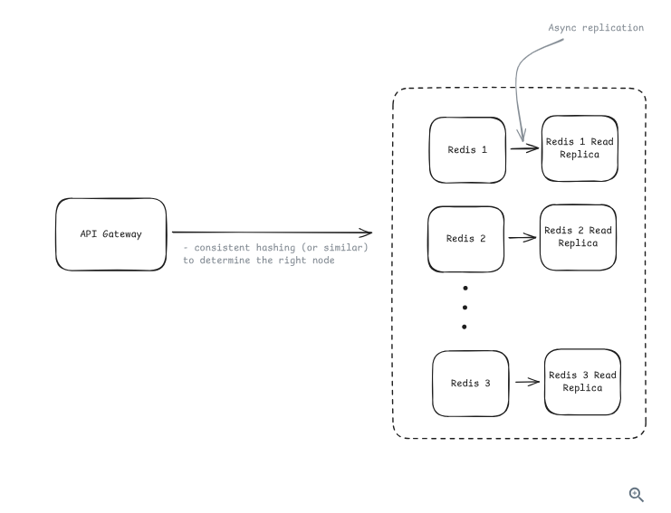

## 3) How do we minimize latency overhead?
```
Earlier, you established a non-functional requirement that the rate limiter must add < 10ms of latency to a request. But now that your architecture requires the API Gateway to make a network call to a Redis cluster, hitting that 10ms target is actually quite difficult due to the laws of physics and networking.

Earlier, you established a non-functional requirement that the rate limiter must add < 10ms of latency to a request. But now that your architecture requires the API Gateway to make a network call to a Redis cluster, hitting that 10ms target is actually quite difficult due to the laws of physics and networking.
Geographic Distribution (Fighting the Speed of Light)
Even with connection pooling, distance matters. If your user is in Tokyo, but your Redis cluster is in Virginia, the physical distance the data has to travel back and forth will cause high latency.

The Solution: Deploy your rate-limiting infrastructure globally. Put a set of API Gateways and a Redis cluster in Asia, another set in Europe, and another in the US.

The Trade-off (Eventual Consistency): This brings us full circle to a decision made on the very first page of this guide. If you have multiple global clusters, they have to sync with each other asynchronously in the background. If a user rapidly routes through Tokyo and then Virginia, their token count might be momentarily out of sync, but we already decided that "Eventual Consistency" is an acceptable trade-off for speed and availability


```

### 4) How do we handle hot keys (viral content scenarios)?
```
You just solved the bottleneck problem by using consistent hashing to spread your 1 million requests across 10 different Redis shards. But what happens if 100,000 of those requests all come from the same user or the same IP address?

Because your hash function guarantees that a specific user always goes to a specific shard, all 100,000 requests will flood a single Redis instance, completely melting it down while your other 9 shards sit idle. This is a "hot key."

The Two Causes of Hot Keys
Hot keys aren't always malicious attacks. You have to design for two very different scenarios:

Legitimate High-Volume Traffic: This could be a massive corporate office sharing a single public IP address (NAT), a poorly optimized mobile app stuck in an aggressive refresh loop, or a legitimate data-pipeline partner running a massive nightly sync.

Abusive Traffic: This is the malicious side—DDoS attacks, scrapers, or botnets intentionally trying to overwhelm your servers.

Defense Strategy: Legitimate Traffic
You don't want to permanently ban your actual users. Instead, you use architectural pressure to force them to behave better.

Client-Side Rate Limiting: This ties back to the Retry-After headers we discussed earlier. You provide an SDK to your developers that automatically reads those headers and pauses outgoing requests. This smooths out the traffic before it ever leaves their device.

Batching: If a client needs to create 50 records, force them to use a single /batch-create endpoint rather than making 50 separate API calls. One HTTP request equals one rate limit check.

Premium Tiers: If a partner genuinely needs to make 50,000 requests a second, move them off the shared Redis cluster and onto their own dedicated infrastructure.
Defense Strategy: Abusive Traffic
When the traffic is malicious, your goal is to drop it as cheaply and quickly as possible.

Automatic Blocking (The Penalty Box): If a user hits their rate limit 10 times in a single minute, they aren't just confused; they are likely a bot. Your system should automatically add them to a temporary blocklist.

Edge Protection: Services like Cloudflare or AWS Shield sit in front of your entire infrastructure. They use machine learning to identify massive DDoS attacks and block the traffic at the network edge, meaning those requests never even reach your API Gateways.

Applying this to your Go Implementation
The "Automatic Blocking" strategy is highly relevant to how you will write your Go middleware.

If an IP is known to be abusive, you don't want to waste time doing a network round-trip to Redis just to find out they are still blocked. Instead, you can keep a small, ultra-fast local cache (using a Go sync.Map or a library like hashicorp/golang-lru) directly inside your API Gateway's memory. When a request comes in, you check the local blocklist first. If they are on it, you instantly return a 429 or 403, saving Redis from the load entirely.

You have now covered the complete lifecycle—from the basic Token Bucket theory to a sharded, highly available, hot-key-resistant distributed architecture.

As you transition from reading to coding, what web framework or routing library (like standard net/http, Gin, or Chi) are you planning to use to build out the API Gateway that will host this middleware?


```


### 5) How do we handle dynamic rule configuration?
```
Up until now, we assumed rules were static (e.g., "Alice always gets 100 requests"). But in production, you need the ability to change these rules on the fly—for instance, dropping the global limit from 50k to 10k during a massive DDoS attack—without having to rewrite your code, recompile your Go app, and restart your servers.

Here are the two architectural approaches for getting dynamic rules from a database into the memory of your running API Gateways.

The "Good" Solution: Poll-Based Configuration
How it Works (Pull): The API Gateway is proactive. It has a background worker (in Go, this would be a goroutine with a time.Ticker) that wakes up every 30 seconds, reaches out to a database, and asks, "Have the rules changed?" If yes, it downloads the new rules into its local memory.

The Pros: It is incredibly easy to implement and highly resilient. If the database goes down, the gateway just keeps using the last known rules.

The Cons: The update delay. If an engineer lowers the rate limit to stop a live attack, it will take up to 30 seconds for all the gateways to realize the rule changed. For 30 seconds, the attack continues.

The "Great" Solution: Push-Based Configuration
How it Works (Push): The API Gateway is reactive. It establishes a persistent, always-open connection to a centralized configuration manager (like Apache ZooKeeper, etcd, or Redis Pub/Sub). When an engineer updates a rule, the configuration manager instantly pushes that update down the open connection to all connected gateways.

The Pros: Near-instantaneous updates. Changes take effect across your entire global infrastructure in milliseconds, making it ideal for fighting live security incidents.

The Cons: High operational complexity. Maintaining thousands of persistent connections is difficult. You have to write complex Go code to handle what happens if the connection drops, if a gateway misses an update message, or if the push system itself crashes.


```
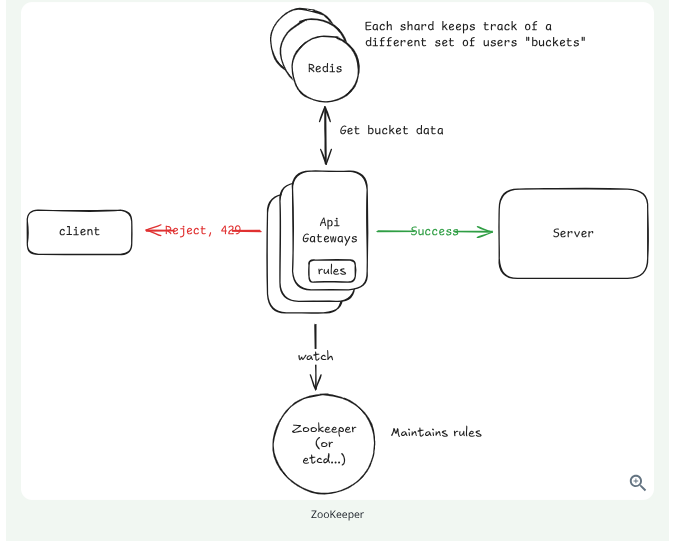

## staff level vs senior
```
Mid-Level (80% Breadth / 20% Depth)
The Goal: Prove you can build a system that meets the basic functional requirements.

The Expectation: You need to know the core building blocks. You should be able to confidently explain how the Token Bucket works, state that you would put it in an API Gateway, and know that you need Redis to share the state across servers.

The Forgiveness: Interviewers don't expect you to proactively spot every flaw. If they ask about scaling, it is perfectly fine to give a high-level answer like, "We would need to shard Redis," without necessarily knowing how to write the consistent hashing algorithm from scratch.

Senior (60% Breadth / 40% Depth)
The Goal: Prove you can build a system that survives the harsh reality of production.

The Expectation: This is where you must discuss trade-offs. A senior engineer doesn't just pick a technology; they justify it against the alternatives. You are expected to proactively bring up the exact concepts we just reviewed:

Defending against race conditions using Atomic operations (MULTI/EXEC).

Understanding the pros and cons of Fail-Closed vs. Fail-Open.

Explaining how Consistent Hashing routes traffic in a Redis Cluster.

Identifying bottlenecks and suggesting Connection Pooling for latency and strategies for Hot Keys.

. Staff+ (40% Breadth / 60% Depth)
The Goal: Prove you can operate, monitor, and scale a system globally across multiple data centers.

The Expectation: At this level, the basic architecture is assumed. You should breeze through the Token Bucket and Redis setup to spend the majority of the interview discussing deep operational challenges.

The Focus Areas:

Multi-region deployments: How do you keep rate limits eventually consistent between a data center in Tokyo and one in Virginia?

Observability: How do you set up metrics, logs, and alerts so you know before the customer does if the rate limiter is failing?

Canary Deployments: If you are rolling out a brand-new rate-limiting rule, how do you deploy it to just 1% of users first to ensure it doesn't accidentally block legitimate traffic?

```

## study about leafy-bucket
```
The Idea

Imagine a bucket with a small hole at the bottom.

Water = Incoming requests
Bucket = Queue (buffer)
Hole = Fixed processing rate
           Requests
        💧 💧 💧 💧 💧
              ↓

         +-----------+
         |           |
         |  Bucket   |
         |           |
         +-----------+
               |
               | 1 request/sec
               ↓
          Processed requests

No matter how fast water is poured into the bucket, it leaks out at a constant rate.

For API rate limiting (GitHub, Stripe, AWS APIs, etc.):

✅ Token Bucket is more common because it allows short, legitimate bursts.

For network traffic shaping (routers, switches):

✅ Leaky Bucket is commonly used because it enforces a smooth, constant output rate.

```